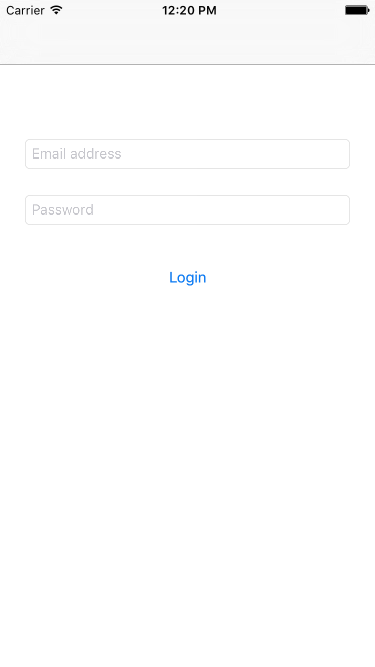
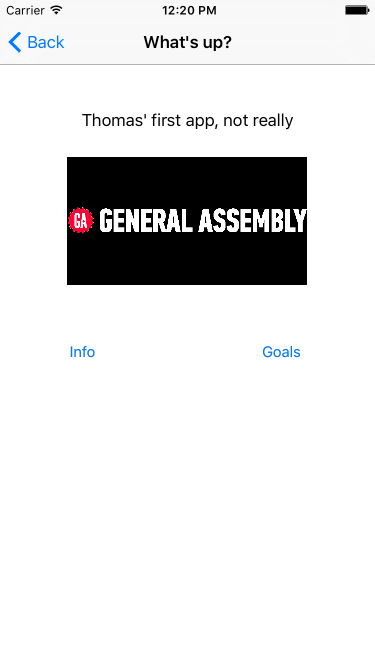
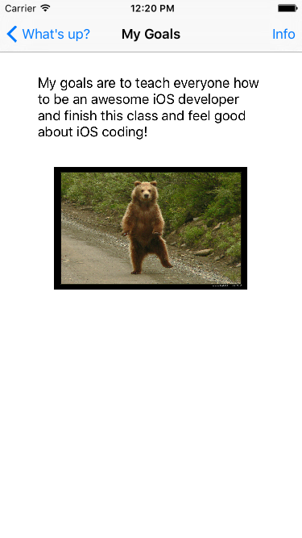
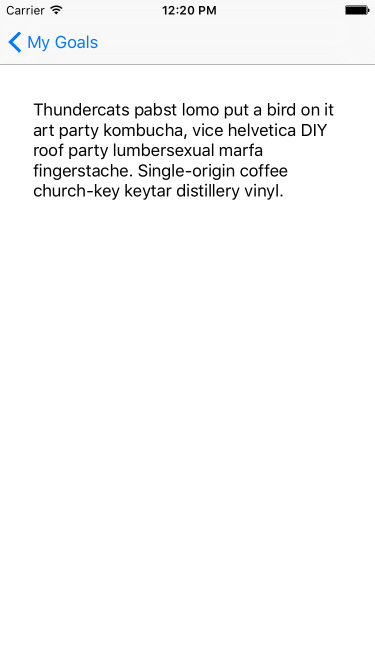

# Assignment 1: Intro to Storyboards

### PROMPT

**Goal**: *Build a simple app that displays a login scene and segues into a short bio and goals for yourself.*

For this first assignment you will build a simple app with a Scene that simulates a login process and a Scene that contains a short personal bio.

You'll learn how to navigate Xcode and Interface Builder and quickly prototype **multi-scene apps**.

**VIDEO:** We've outlined the steps to help you build your first assignment. Before you jump in, watch [this video](https://youtu.be/zrlmYGrtx3w) to understand how your application should function.

**You will be working individually for this project**, but we'll be guiding you along the process and helping as you go.

---

### DELIVERABLES

Your app must:

* use a storyboard,
* start with a login scene with email and password text fields,
* have a login button that when tapped shows a scene with a picture,
* have buttons labeled "Info" and "Goals" that each push a new scene, and
* follow the specific requirements and constraints below.

#### View Controller 1: Login Scene

**Part 1**: Create a login scene by adding a new view controller from the library, then adding to it two text boxes and a button that says "Log in."

* Configure the first text box such that when the user taps it, the keyboard that pops up is an email-entry keyboard. The second text box should obscure the typed text (i.e. be a password field).
* Make the login scene the first that the user sees when they launch the app (i.e. the initial view controller).
* Hint: When creating the second text field for the user's password, make sure you select the "Secure Text Entry" property of the `UITextField`.

#### View Controller 2: Images and Text Fields

**Part 2**: When the user taps on the "log in" button on the login scene, the app should segue to the preexisting view controller (that came with the app).

Push transitions are managed by a `UINavigationController`. You'll need to add one to the Storyboard to get started.

* Select your login scene and in the menu bar at the very top, click Editor > Embed In > Navigation Controller.
* When the user clicks on the "Login" button, we want to start a "push segue" to the existing view controller.
* To set it up, control + mouse click from the "Log in" button and drag the blue line onto the preexisting scene (with the General Assembly logo). Let go. When the context menu appears, select "Push".
* Make the text above the buttons say "{Your name}'s first app".
* Change the attributes of the image view in the preexisting scene to contain a picture of yourself.

#### View Controller 3: Segues

**Part 3**: When tapped, the "Info" button in the scene should display a view controller via a modal segue (animated from bottom to top). That view controller should contain a short bio of you.

* Drag a new `UIViewController` onto the storyboard canvas and connect a new modal segue from the "Info" button to it.
* Add a `UITextView` to the view controller and place your bio there.

**Part 4**: When tapped, the "Goals" button of the app should push segue to a new view controller. This page contains text that describes a short blurb about what you’re hoping to get out of this class. The text should be red and bold. Below the text should be an image of one of your favorite things.

* Drag a new `UIViewController` onto the storyboard canvas and connect a new push segue from the "Goals" button to it.
* Add a `UIImageView` containing an image of a cat or a dog.
* Add a `UITextView` below the image and write a short blurb explaining your goals for the course.

#### Advanced

**Part 5**: The top righthand side of the navigation bar on the "Goals" scene should have another button called "Info." When the user taps it, another scene should appear via a push segue.

* From the "Goals" view controller, add a `UIBarButtonItem` to the right side of the navigation bar at the top.
* Place another `UITextView` there and expound on your goals.

---
### SUBMISSION

* A working **XCode project**, built by you, uploaded to your Github repo.
* Send your **Github page link** to the instructional team via email/Slack.
* A **README** file on your repo with explanations of the approach taken.

---

### EVALUATION

Your assignment will be evaluated by your instructor(s) in the following areas:

1. __Technical Requirements__: Did you deliver a project that met all the technical requirements?

2. __Code Quality__: Did you follow code style guidance and best practices covered in class?

3. __Distribution__: Did you deploy your application to GitHub Pages? Can my instructor build and run my app?

Score | Expectations
----- | ------------
**0** | _Incomplete._
**1** | _Does not meet expectations._
**2** | _Meets expectations, good job!_
**3** | _Exceeds expectations, you wonderful creature, you!_

This will serve as a helpful overall gauge of whether you met the project goals, but __the more important scores are the individual ones__ above, which can help you identify where to focus your efforts for the next project!

---
### RESOURCES

* [Apple’s intro to Interface Builder](https://developer.apple.com/library/mac/documentation/ToolsLanguages/Conceptual/Xcode_Overview/Edit_User_Interfaces/edit_user_interface.html)
* [Github’s git walkthrough:](https://try.github.com)
* [A two-part tutorial on Storyboards](http://www.raywenderlich.com/50308/storyboards-tutorial-in-ios-7-part-1)
