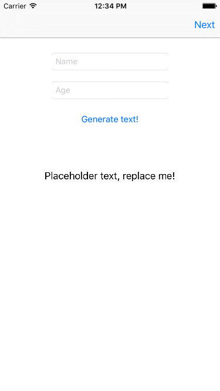
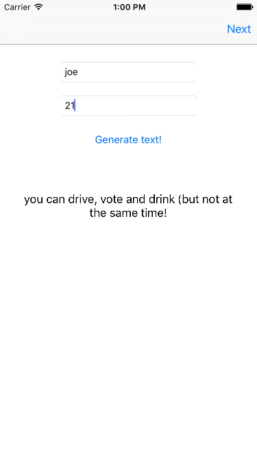
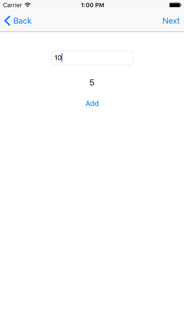
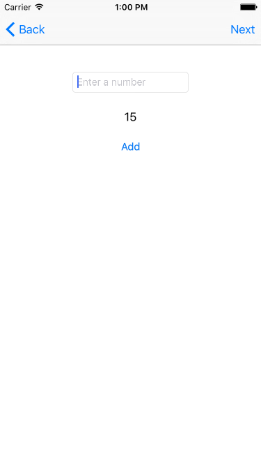
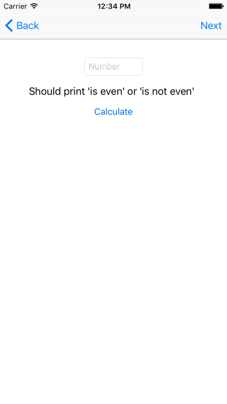
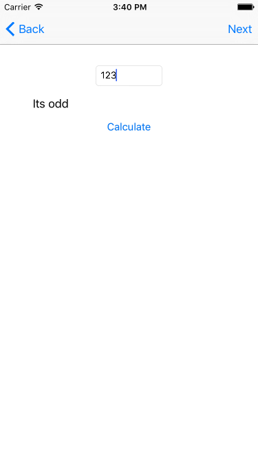
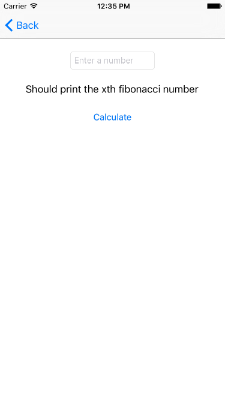

#  Assignment 2: View Controllers I

### PROMPT

**Goal**: *build an age verification and basic arithmetic application!*

Let's start out with something fun - create a **simple app** that verifies the users age and whether or not they can drive, drink or vote. You'll also build into it a basic calculator that adds numbers and verifies whether the sum is odd or even.

Using Interface Builder, you'll lay the foundations for an app. Then you'll be writing basic control flow statements. This is also a chance to use common programming constructs (e.g. "variable", "method", "class", etc.). In addition, you'll get a chance to dive deep into learning **special methods** triggered by user-interface objects.

**VIDEO:** We've outlined the steps below to help you build what you need. Before you jump in, [watch this video](https://youtu.be/rIcrO5j-rt0) to understand how your application should function.

**You will be working individually for this project**, but we'll be guiding you along the process and helping as you go.

---

### DELIVERABLES

Your app must:

* update a `UILabel` triggered by user-driven events,
* interpolate Strings to display the name and age entered by the user,
* use text fields, buttons, and labels,
* add numbers that the user inputs (after tapping a button), and
* follow the specific requirements and constraints below.

#### View Controller 1 - Updating Labels

**Part 1**: Create a function in the view controller class to make “Placeholder text, replace me!” label to say, “Hello World!”

* You must connect the touch-up action of the "Generate text" button to this new function.
* Hint, use `@IBAction` with this function.

**Part 2**: Make the app interpolate the values the user enters into a new String.

* Make connections from "name" and "age" text fields to `@IBOutlet`s the view controller's class definition.
* When the user taps "Generate text!", the values in the text fields should appear in the label like this: "Hello {name}, you are {age} years old!"
* Hook up the button to a second function (also using `IBAction`) that implements this behavior.

**Part 3**: Now make the app comment on the user's age.

* If the user enters 21 or greater, update the view controller's label to say, "You can drink."
* If the user enters 18 or greater, display "You can vote".
* If the user entered 16 or greater, make the view controller's label say, "You can drive."
* Hook up the "Generate text!" button to a third function that implements this behavior.

**Part 4**: Combine those comments in another function.

* If the user entered 16 or 17, make the view controller's label say, "You can drive."
* If the user entered 18 or greater but less than 21, display "You can drive and vote".
* If the user entered at least 21, update the view controller's label to say, "You can vote, drive, and drink (but not at the same time!)."
* Hook up the "Generate text!" button to a fourth function that implements this behavior.

#### View Controller 2 - Adding Numbers

**Part 5**: In this Scene, add a text field, a text label, and a button that says "Add".

* When the text field is tapped, the keyboard that pops up should be a number pad.
* The user should enter numbers in the text field.
* Display the cumulative sum of all numbers entered each time the "Add" button is tapped.

#### View Controller 3 - Is this number even?

**Part 6**: Create another Scene with a number-pad-keyboard text field, a label, and a button that says "Calculate."

* When the button is tapped, a message should appear in the label indicating whether the number is "even" or "odd."

#### View Controller 4 - Bonus Round!

**Part 7 (Bonus Round!)**: Create another Scene with yet another text input box, a label, and button labeled "Calculate."

* The expected behavior is for the user to input a number in the text field, tap the button, and see the label update.
* Connect an `@IBAction` function to the button.
* Create a `FibonacciAdder` class with a method `fibonacciNumberAtIndex(indexOfFibonacciNumber:Int)` which accepts `indexOfFibonacciNumber` (an integer) and responds with a Fibonacci number.
* When the button is tapped (and the `IBAction` called):
  * An instance of the class should be used to calculate the appropriate Fibonacci number.
  * Display that number in the label.

---

### Submission

* A working **XCode project**, built by you, uploaded to your Github repo.
* Send your **Github page link** to the instructional team via email/Slack.
* A **README** file on your repo with explanations of the approach taken.

---

### EVALUATION

Your assignment will be evaluated by your instructor(s) in the following areas:

1. __Technical Requirements__: Did you deliver a project that met all the technical requirements?

2. __Code Quality__: Did you follow code style guidance and best practices covered in class?

3. __Distribution__: Did you deploy your application to GitHub Pages? Can my instructor build and run my app?

Score | Expectations
----- | ------------
**0** | _Incomplete._
**1** | _Does not meet expectations._
**2** | _Meets expectations, good job!_
**3** | _Exceeds expectations, you wonderful creature, you!_

This will serve as a helpful overall gauge of whether you met the assignment goals, but __the more important scores are the individual ones__ above, which can help you identify where to focus your efforts for the next project!

---
### RESOURCES

* [Apple’s guide to Swift control flow](https://developer.apple.com/library/prerelease/mac/documentation/Swift/Conceptual/Swift_Programming_Language/ControlFlow.html)
* [Apple’s guide to writing functions in Swift](https://developer.apple.com/library/prerelease/mac/documentation/Swift/Conceptual/Swift_Programming_Language/Functions.html#//apple_ref/doc/uid/TP40014097-CH10-XID_245)
